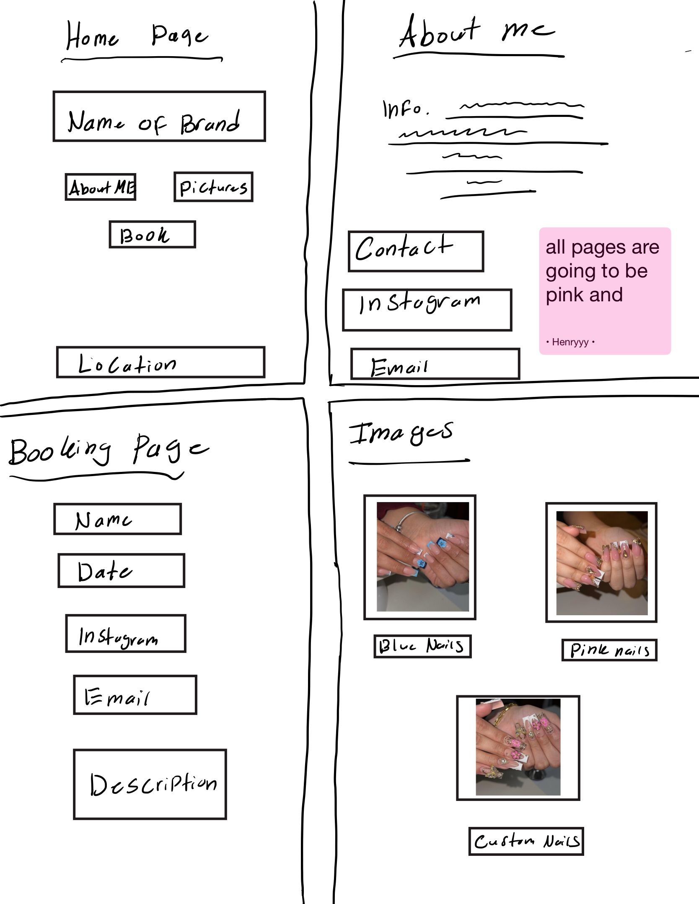

# NailsWebsiteProject

**Design Inspiration:** [Nails4Dollss](https://nails4dollss.square.site/?utm_source=ig&utm_medium=social&utm_content=link_in_bio)

PART 1: CONTENT (Answer ALL questions, add your own if necessary)

1. What is the name of your business?
Gabriela Nails
2. Is the business real or fictional?
The business is a real business of a friend that I know who is currently in the nails business.
3. What products or services does the business offer?

This service provides details on who the nail technician is, images of their work to show off, and how to book appointments.

4. Who is the target audience?

Anyone who is interested in doing their nails, could be for a pedicure or could be to have them done with designs.

5. What problem does this business solve?

It solves problems such as getting to know who the nail tech is, as well as if you like the way they work, and how you can book an appointment with them.

6. What makes this business unique compared to competitors?

What makes it unique compared to others is that instead of just having a book and an appointment and not knowing if they match your style, it will provide images and descriptions for the best understanding.

7. What pages will your website include (e.g., Home, About, Services, Contact)?

It will have a home page,an about me, book an appointment page, and images of their work.

8. Write a short mission statement for the business.
The mission for this business is to satisfy the needs of our customers by providing amazing customer service. As well as to take care of our customers' nails and give them great experience and product use.

9. What tone should the website content have (professional, friendly, modern, etc.)?

This is a business so it will definitely be professional but also friendly to be able to understand and have easy access to.

10. What call-to-action do you want visitors to take?
Book consultation and be able to contact the nail technician. 
11. What information must be immediately visible on the homepage?

The Homepage for me should look intriguing, so it will have the name and the name of the business with 3 different options, Book appointment, about me, and images of work.

12. Will the site include images, videos, or other media? Why?

Yes it will have images, a link to the instagram page that will have more available pictures, and have their contact information. 
--------------------------------------------------
PART 2: DESIGN (Answer ALL questions, add your own if necessary)

1. What overall style will the website have (minimalist, corporate, creative, etc.)?
It’s becoming more of a creative website, still professional but has creativity to show images and have bookings. 

2. What color scheme will you use and why?
I wanna give an effect of who the person is. I feel like having a bit a white and pink mixed with some other color will best match the theme or idea of the nail tech website.

3. What fonts will you use for headings and body text?
I will be using time new roman for everything but of course change the font size for the heading compared to the body text.

4. How will spacing and layout improve readability?
It will have enough spacing as normal text, the heading will be big but the description will be a little smaller but still a formidable size to be able to read.

6. What visual hierarchy will guide the user’s attention?
The images and creativity will keep them engaged, but the easy to navigate I will put on the website will make it easy for any user to understand.

7. How will consistency be maintained across pages?
The theme of the website background will stay the colors white and black. While keeping it as just English as google supports google translate most of the time and will translate it to any preferred language already set up on your personal device. 

8. What icons will you use?
Instagram
Email
Phone number
location

9. What emotions should the design evoke in users?
The user should feel comfortable and excited when they see something they like and is able to book quickly.

10. How will accessibility be considered (contrast, font size, etc.)?
It will be made at a comfortable size and contrast where it doesn’t bother the person but is easy and engaging to understand.

11. What inspiration sources influenced your design?
I got most of my inspiration from an instagram users website by the name of nails4dollss, her layout was similar to the one I have but instead of making it one long page that has all her information. I decided I was going to have different parts (sections) to be able to have their own separate page.

12. Describe the layout of the homepage and build the wireframe
The layout of the homepage is simple, and will have the name of the brand big in the middle of the screen. Underneath that there will be three buttons to choose from, about me, book appointment, and images of nails. Will also have the location all the way at the bottom of the page so the user can know where they will need to go for the location. 
--------------------------------------------------
PART 3: INTERACTIVITY (Answer ALL questions, add your own if necessary)

1. What interactive elements will your site include (forms, buttons, menus, etc.)?
The website will have buttons, dates for appointment, images to be able to click on and view, and a lot of interaction options.

2. How will users navigate the website?
The user will be able to interact with the website by scrolling with their mouse, just needing to click on what part of the website they want to go to. (Ex. If they want to see the about me, I would just need to click on the “about me button” and will take them to the about me page.)

3. Will there be form validation or user feedback? Explain.
The website's main objective is to be able to see the work, know a little more about the nail tech, and to be able to book. As it goes for the feedback it will be linked with the instagram of the nail tech so you would be able to leave feedback either on instagram or share their profile to others. 

4. What JavaScript functionality will you implement?
It will grab appointments from all the users to make sure whenever a new user books an appointment, they won’t be able to make the same appointment as someone else who chose it first.

5. How does interactivity improve user experience?
The user will be able to leave feedback on the website using their email which will then pop up and show the reviews on the website to let others know how your experience was.

Project Overview:

A high end single web application desgined for my friend Gabriela Vega, who is a professioanl nail technician and influencer. The purpose of the site is to be a digital portfolio and streamlined booking tool, helping bring out her creativity and business more.

Target Audience:

* Local clients in NY who is looking for a luxery nail service.
* Brand collaborators and followers from her social media plateform and who want to see her professional evolution.
* People who want convenience, high value, presonalized influencer to client experience
  
Content Strategy:

The strategy used here was visual authority, strong branding with focus on the artist location and name, high quality images to showcase expertise, and to connect her life a a business student and creator into the nails industry.

Information Organization

The website uses linear navigation stucture, in one singler file, but divided into different parts.
Such as:
Home, About, Work, and Book.

Visual Design

Style: Minimalist Boutique / Editorial.

Color Palette: White, Soft Pink (#fff0f3), and Deep Magenta (#d4418e) for accents.

Typography: A pairing of Playfair Display (classic luxury) and Montserrat (modern clean).

Wireframe Concept:

Desktop: Fixed navigation at the top, wide-grid gallery, and centered form.

Mobile: Responsive "stacked" layout where buttons expand to full width for easy thumb-tapping.

Interaction / Functionality

SPA Navigation: Smooth section switching without page reloads using JavaScript display: flex/none.

Hover Effects: Grayscale-to-color transitions on portfolio images and "lift" animations on buttons.

Dynamic Booking: A real-time availability logic that generates time slots only after a date is selected and disables "booked" times.

Technical Overview

HTML5, CSS3 (specifically Flexbox and Grid), and Vanilla JavaScript.
Github pages(Utilizing the automated deployment through GitHub actions).
Local storages within GitHub repository to make sure the uptime and correct path was at 100%.
Integrating font for icongraphy and google fonts for typography.

Timeline / Project Milestones

Creating a luxery pink theme and font pairing. 
Coding using logic and responsive HTML, CSS, JavaScript.
Uploading the images to the website page without it crashing or bugging.
Setting my Github repository and fixing image pathing.
Try to make the email like google where if someone chooses that date it will not let another user use that as well. 

